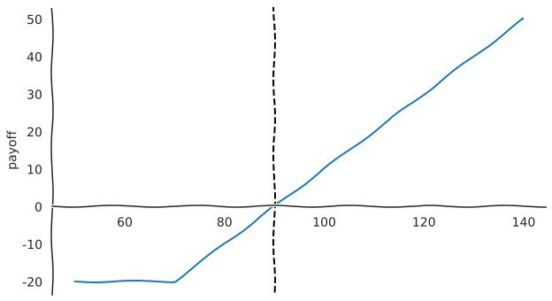

Derivatives are financial instruments which are priced based on an underlying
asset. An example would be a forward contract for 10kg of rice. It is mid May
and your 10kg bag of rice holds at most 3 cups left, not enough for the week.
The current price of a 10kg bag of rice is... 80 HKD. Speculating the increase
in demand for rice will increase the value of a 10kg of rice to 190 HKD you
agree with your local rice vendor to buy a 10kg of rice on the at 90 HKD and an
extra 10 HKD for peace of mind/ commission?

So what happens if the price in a months time increases by 10 HKD? You end up
spending 100 - 90 = 10 extra HKD. In hindsight you make excuses to why you were
wrong. You are adamant, with high certainty, that the price of rice was
uncertain in the following month.  You ask the rice vendor, did I really need
to buy the bag of rice at this date at this price?

Yes, he says, But, if you wanted extra freedom you could have bought an option
instead?

What's that? You ask.

It's a contract where you *have the right but not the obligation* to buy the
underlying asset when the contract ends. It gives you a bit of freedom at the
expiration date &mdash; it does cost a bit more.

I'll keep that in mind for next time.

