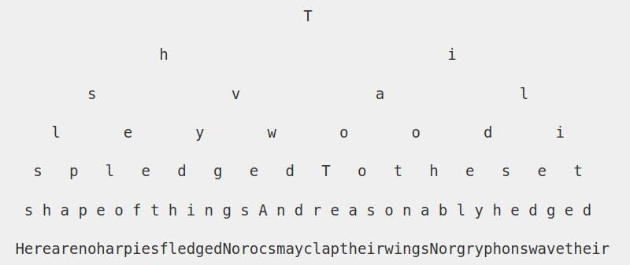

My decision to take up writing has led me to sporadically output what pops into
my head when I'm near my Pentel 205, Pilot G5 and A6 notepad or sat in front of
the keyboard of my laptop.

It's caused me to forget many important-at-the-time insights that may return
one day. I've grown a habit of starting many 'threads' and leaving them to
hang. 

I say this as I just interrupted another reflection on stray cats.

It's not too dissimilar to how brains naturally process thoughts. Non-linear.
Weaving from topic to topic, falling short to fully resolve an idea before
moving onto the next. At this current stage of romantic novelty, I am far from
creating a strict routine in which I can consistently churn out lines of text. 

That was my original point of this script. Beginning to write is often the
hardest step. Writer's block is real. However, when the moment arrives and the
flood gates are let loose, let loose. Don't try to contain the stream of
consciousness, apply pen to paper, fingertips to the keyboard. 

I say this while still avoiding the topic title. 

Grow the tree, whip up a first draft. Sure there'll be reams of content you'll
want to cut out, paragraphs that will need to be edited but that comes after
with pruning your tree. 

-----------------------------------------------------------------

      
