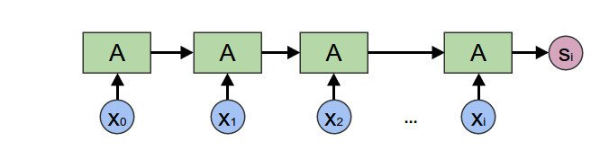
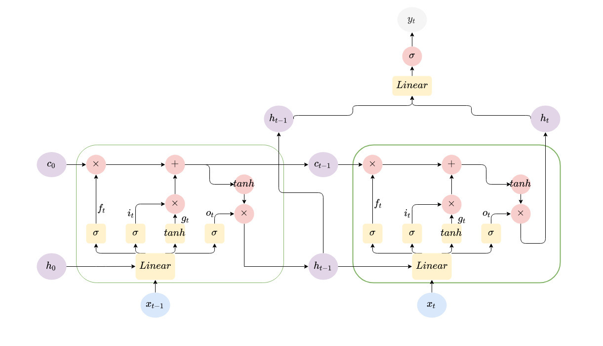

**Problem Statement:** 

Train an LSTM to solve the XOR problem: that is, given a sequence of bits,
determine its parity. The LSTM should consume the sequence, one bit at a time,
and then output the correct answer at the sequence’s end. 

Test the two approaches below:

- Generate a dataset of random 100,000 binary strings of length 50. Train the
  LSTM; what performance do you get?
- Generate a dataset of random 100,000 binary strings, where the length of each
  string is independently and randomly chosen between 1 and 50. Train the LSTM.
  Does it succeed? What explains the difference?


LSTM networks have been used with success on sequential data. 

A great introduction to recurrent neural networks, specifically LSTM (long
short-term memory) networks can be found reading through Chris Olah's
explanation on [understanding
LSTMs](https://colah.github.io/posts/2015-08-Understanding-LSTMs/).

In the problem statement it specifies "The LSTM should consume the sequence,
one but at a time &hellip;"

As we are considering sequential data it seems that an LSTM would be a good
architectural choice in training a neural network to learn the parity of
a sequence of bits. 

**Parity.**

: The parity of a sequence checks the number of 1-bits. In our case we will
consider odd-parity, the function returning 1 if the number of bits in
a sequence is odd, 0 if even.

**Parity function.**

: The function takes in a sequence of bits and returns the parity bit of the
sequence. Returning 1 if the sequence contains an odd amount of 1-bits,
0 otherwise.

The parity function can be written as $$f(\textbf{x}) = x_1 \oplus x_2 \oplus \ldots \oplus x_n$$

where $\oplus$ is the XOR function defined by the table below


A | B | A $\oplus$ B
---| ---| ----
0 | 0 |  0
0 | 1 |  1
1 | 0 |  1
1 | 1 |  0


```python
import operator
import functools
import random

>>> def foldl(func, acc, xs):
...    return functools.reduce(func, xs, acc)  

>>> foldl(operator.add, 0, [1,2,3,4,5,6,7,8,9,10])

55
```

```python

# parity check, function = xor, acc = 0 sequece, 0s and 1s
>>> random.seed(1)

>>> print("bitstring     |  parity ")
... print("-"*25)
... for _ in range(1):
...     seq = [random.randint(0,1) for _ in range(12)]
...     print(f"{''.join(str(b) for b in seq)}  |    {foldl(operator.xor, 0, seq)}")

bitstring     |  parity 
-------------------------
001011110010  |    0

```


```python
random.seed(1)

def trace_xor(a, b):
    """
    shows the intermediate steps of 
    xor function on 
    a sequence
    """
    result = operator.xor(a, b)
    print(f"{a} XOR {b} = {result}")
    return result


print(foldl(trace_xor, 0, [1,0,0,1,1]))

0 XOR 1 = 1
1 XOR 0 = 1
1 XOR 0 = 1
1 XOR 1 = 0
0 XOR 1 = 1
1
```

The middle column corresponds to our bit string we want to check. Notice the
left column is the previous result from XOR(a, b). As a consequence, the final
result only depends on XOR of the previously returned result. In our example the
last bit of our sequence being 1 and the previously returned XOR result, 0. 

## Experiment

- Generating parity data 
- Training and evaluating LSTM


```python

import torch
import torch.nn as nn
import torch.utils.data as data
from torch.utils.data import DataLoader
device = 'cuda' if torch.cuda.is_available() else 'cpu'
```

```python
# Data
TRAINING_SIZE   = 100000
VALIDATION_SIZE = 10000
BIT_LEN = 50
VARIABLE_LEN = True

# Model Parameters
INPUT_SIZE = 1
HIDDEN_SIZE =  2
NUM_LAYERS = 1

# Training Parameters
BATCH_SIZE = 8
EPOCHS = 8
LEARNING_RATE = 0.01 # DEFAULT ADAM 0.001

THRESHOLD = 0.0001
```


```python
class XOR(data.Dataset):
    """ GENERATE XOR DATA """

    def __init__(self, sample_size=VALIDATION_SIZE, bit_len=BIT_LEN, variable=False):
        self.bit_len = bit_len
        self.sample_size = sample_size
        self.variable = VARIABLE_LEN
        self.features, self.labels = self.generate_data(sample_size, bit_len)
    
    def __getitem__(self, index):
        return self.features[index, :], self.labels[index]
    
    def __len__(self):
        return len(self.features)


    def generate_data(self, sample_size, seq_length=BIT_LEN):
        
        bits = torch.randint(2, size=(sample_size, seq_length, 1)).float()
        if self.variable:
            # we generate random integers and pad the bits with zeros
            # to mimic variable bit string lengths 
            # padding with zeros as they do not provide information
            # TODO: vectorize instead of loop?
            pad = torch.randint(seq_length, size=(sample_size, ))
            for idx, p in enumerate(pad):
                bits[idx, p:] = 0.

        bitsum = bits.cumsum(axis=1)
        # if bitsum[i] odd: -> True
        # else: False
        parity = (bitsum % 2 != 0).float()

        return bits, parity
```

```python
class XORLSTM(nn.Module):
    def __init__(self, input_size, hidden_size, num_layers):
        super(XORLSTM, self).__init__()
        self.hidden_size = hidden_size
        self.num_layers  = num_layers
        
        self.lstm = nn.LSTM(input_size, hidden_size, num_layers, batch_first=True)
        self.fc  = nn.Linear(hidden_size, 1)
        self.activation = nn.Sigmoid()
    
    def forward(self, x, lengths=True):
        h0 = torch.zeros(self.num_layers, x.size(0), self.hidden_size).to(device)
        c0 = torch.zeros(self.num_layers, x.size(0), self.hidden_size).to(device)
        # Forward propagate LSTM
        out_lstm, _ = self.lstm(x, (h0, c0))  
        out = self.fc(out_lstm)

        predictions = self.activation(out)
        return predictions

```


```python
model = XORLSTM(INPUT_SIZE, HIDDEN_SIZE, NUM_LAYERS).to(device)
criterion = nn.BCELoss()
optimizer = torch.optim.Adam(model.parameters(), lr=LEARNING_RATE)
```


```python
# train
def train():
    model.train()
    train_loader = DataLoader(
                    XOR(TRAINING_SIZE, BIT_LEN, VARIABLE_LEN), 
                    batch_size=BATCH_SIZE
                    )
    total_step = len(train_loader)

    print("Training...\n")
    print('-'*60)

    for epoch in range(1, EPOCHS+1):
        for step, (features, labels) in enumerate(train_loader):
            features, labels = features.to(device), labels.to(device)

            # Forward pass
            outputs = model(features)
            loss = criterion(outputs, labels)
            
            # Backward and optimize
            optimizer.zero_grad()
            loss.backward()
            optimizer.step()
            accuracy = ((outputs > 0.5) == (labels > 0.5)).type(torch.FloatTensor).mean()
            
            if (step+1) % 250 == 0:
                print ('Epoch [{}/{}], Step [{}/{}], Loss: {:.4f}, Accuracy: {:.3f}' 
                       .format(epoch, EPOCHS, 
                        step+1, total_step, 
                        loss.item(), accuracy))
                print('-'*60)
                if abs(accuracy - 1.0) < THRESHOLD:
                    print("EARLY STOPPING")
                    return

            if step+1  == total_step:
                valid_accuracy = validate(model)
                print("validation accuracy: {:.4f}".format(valid_accuracy))
                print('-'*60)
                if abs(valid_accuracy - 1.0) < THRESHOLD:
                    print("EARLY STOPPING")
                    return 
```


```python
def validate(model):
    valid_loader = DataLoader(
                    XOR(VALIDATION_SIZE, BIT_LEN, VARIABLE_LEN), 
                        batch_size=BATCH_SIZE
                        )
    model.eval()
    correct = 0.
    total = 0.
    for features, labels in valid_loader:
        features, labels = features.to(device), labels.to(device)

        with torch.no_grad():
            outputs = model(features)
            total += labels.size(0)*labels.size(1)
            correct += ((outputs > 0.5) == (labels > 0.5)).sum().item()
    return correct / total
```


```python
>>> train()

Training...

------------------------------------------------------------
Epoch [1/8], Step [250/12500], Loss: 0.7235, Accuracy: 0.375
------------------------------------------------------------
Epoch [1/8], Step [500/12500], Loss: 0.6935, Accuracy: 0.460
------------------------------------------------------------
Epoch [1/8], Step [750/12500], Loss: 0.6767, Accuracy: 0.618
------------------------------------------------------------
Epoch [1/8], Step [1000/12500], Loss: 0.7001, Accuracy: 0.368
------------------------------------------------------------
Epoch [1/8], Step [1250/12500], Loss: 0.4462, Accuracy: 0.873
------------------------------------------------------------
Epoch [1/8], Step [1500/12500], Loss: 0.0427, Accuracy: 1.000
------------------------------------------------------------
EARLY STOPPING
```

### Model Summary

In viewing neural network architectures as function composition we see
recurrent neural networks can be viewed as a reduce operation on an input
sequence.




    

Considering one bit at a time and remembering the previous partial result in
a recurrent or multi-step architecture reduces the problem of learning k-bit
parity to the simple one of learning just 2-bit parity.

### The Architecture

Below is a diagram showing the architecture of the LSTM.




```python
>>> model

XORLSTM(
  (lstm): LSTM(1, 2, batch_first=True)
  (fc): Linear(in_features=2, out_features=1, bias=True)
  (activation): Sigmoid()
)

```


```python
>>> model(XOR(1, 2).generate_data(1)[0]).size()

torch.Size([1, 50, 1])
```


```python
sampleX.reshape(-1)

tensor([1., 0., 0., 1., 0., 1., 0., 0., 0., 1.,
        1., 1., 0., 0., 1., 0., 0., 0., 0., 1.,
        0., 0., 1., 0., 0., 0., 1., 0., 1., 0.,
        0., 1., 0., 0., 1., 0., 0., 1., 0., 1.,
        1., 0., 1., 0., 1., 1., 1., 0., 0., 1.])
```

**Cumulative parity of sample bit** 

```python
>>> (model(sampleX) > 0.5).float().reshape(-1) 

tensor([1., 1., 1., 0., 0., 1., 1., 1., 1., 0.,
        1., 0., 0., 0., 1., 1., 1., 1., 1., 0.,
        0., 0., 1., 1., 1., 1., 0., 0., 1., 1.,
        1., 0., 0., 0., 1., 1., 1., 0., 0., 1.,
        0., 0., 1., 1., 0., 1., 0., 0., 0., 1.])

>>> sampleY.reshape(-1)

tensor([1., 1., 1., 0., 0., 1., 1., 1., 1., 0.,
        1., 0., 0., 0., 1., 1., 1., 1., 1., 0.,
        0., 0., 1., 1., 1., 1., 0., 0., 1., 1.,
        1., 0., 0., 0., 1., 1., 1., 0., 0., 1.,
        0., 0., 1., 1., 0., 1., 0., 0., 0., 1.])
```

