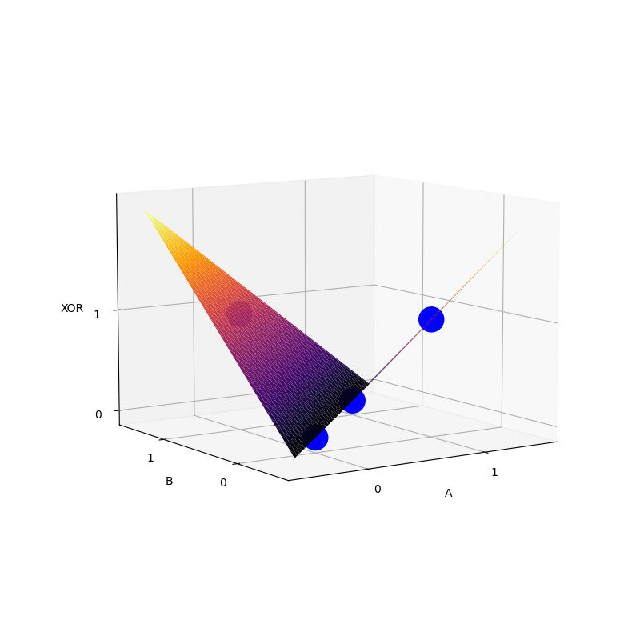

# XOR problem

In learning a new field I don't think an introduction using the most basic
example doesn't help. Using the XOR problem to understand deep learning often
obscures the grander picture. That being said, I'm not sure who this
explanation is for. At the moment, myself. Why? To see how well I can explain
the fundamental concepts of deep learning using a toy example. 


A quick history lesson. 

Perceptrons are functions that perform a linear operation followed by a non
linear function mapping. In general, taking inputs $x_1, x_2, ..., x_n$ to an
output $f(\sum_i^n {w_i x_i})$. Letting $f(z)$ be a step function with value `1
if z > 0 else 0`.

The problem here is that we are only able to find functions that are linearly
separable.

**Multilayer and differentiable activation functions**

What we want to do is add non linearity to our input. By doing so we can
transform our feature space for a linear model to learn.

### The architecture

The network consists of two inputs $x_1$ and $x_2$, a hidden layer $\textbf{h}=
[h_1, h_2]$ and output $y$ 


### Task 

Find the parameters/weights $\theta$ that minimize the error/loss between estimated function $f$ and our estimate $f^*$. We want our $\theta$ values to produce an estimate as close to $f^*$ as possible, or for the loss function L to be as close to zero.

The mean squared error $$ L(\theta) = \frac{1}{2} \sum_{x} (f^*(\textbf{x}) - f( \textbf{x} ; \theta))^2$$ has a nice derivative, $$\nabla{L_{\theta}} = \sum_{x} (f^*(\textbf{x}) - f( \textbf{x} ; \theta)) \nabla f( \textbf{x} ; \theta)$$

i.e. the product of the summed difference and the change in our estimated function $f(\textbf{x}; \theta)$ with respect to a change in $\theta$

### Optimization, Gradient Descent

In thinking of our Loss function as a terrain, we want the coordinates that reaches the lowest valley.

We start at coordinates $\theta_0$. How do we find the deepest valley? Intuitively, a natural step would to go in the direction with the steepest incline by a small $\alpha$ sized step , $-\alpha \nabla_{\theta}{L}$. 

Taking the step, we arrive at a new coordinate $\theta_1$. Repeating this process choose the direction with the steepest decline until we reach our destination.

$\theta_{n+1} = \theta_{n} - \alpha \nabla_{\theta}{L}$

### Backpropagation

Going back to the XOR problem
we have

$$\textbf{x} \rightarrow f(\textbf{W}^T\textbf{x}) = \textbf{h}$$
$$\textbf{h} \rightarrow g(\textbf{w}^T \textbf{h}) \rightarrow \textbf{w}^T f(\textbf{W}^T\textbf{x} ) = y$$

The parameter $\theta$ is made up of different weights $\textbf W$ and $\textbf w$ that the network will need to learn.

Thus 
$$
\begin{aligned}
\nabla_{x} L &= \frac{\partial L}{\partial y} \
&= \frac{\partial y}{\partial (\textbf w^T \textbf h)} \
&= \frac{\partial (\textbf w^T \textbf h)}{\partial h} \
&= \frac{\partial h}{\partial (\textbf W ^T \textbf x)} \
&= \frac{\partial (\textbf W^T \textbf x)}{\partial x}
\end{aligned}
$$
 
$$(y - y^*) \textbf w  f'(.) \textbf W$$

where y is our predicted value, $y^*$ is the true value.

So $$\nabla_{w} L = \frac{\partial L}{\partial y}
\frac{\partial y}{\partial (\textbf w^T \textbf h)}
\frac{\partial (\textbf w^T \textbf h)}{\partial \textbf w} = (y - y^*)  \textbf h $$

and 

 $$\nabla_{W} L = \frac{\partial L}{\partial y} \frac{\partial y}{\partial (\textbf w^T \textbf h)}
\frac{\partial (\textbf w^T \textbf h)}{\partial h}
\frac{\partial h}{\partial (\textbf W ^T \textbf x)}
\frac{\partial (\textbf W^T \textbf x)}{\partial W} = (y - y^*) \textbf w f'(\textbf W ^T \textbf x)\textbf x $$

$$\frac{\partial L}{\partial y} = (y - y^*)$$

$$\frac{\partial (\textbf w^T \textbf h)}{\partial h} = \textbf w$$

$$\frac{\partial h}{\partial (\textbf W ^T \textbf x)} = f'(\textbf W ^T \textbf x)$$

$$\frac{\partial (\textbf W^T \textbf x)}{\partial x}= \textbf W$$

### Activation Function

The most common non-linear function used in modern neural networks is the ReLU 

$$f(z) = \max(0, z)$$

or variations of it. 

Its derivative 

$$f'(z) = \max(0, 1)$$ 

is easy to compute even though it is non differentiable at 0.

The sigmoid function $$g(z) = \frac{1}{1 + \exp(-z)}$$ is used in binary classification problems with derivative $$g'(z) = g(z)(1 - g(z))$$


```python
import numpy as np

X = np.array([[0, 0], [0, 1], [1, 0], [1, 1]])
Y = np.array([[0], [1], [1], [0]])
print(" A  B | XOR(A,B)")
print("-----------------")
for i, bits in enumerate(X):
    print(f" {bits[0]}  {bits[1]} |     {Y[i][0]}")

>>     A  B | XOR(A,B)
>>    -----------------
>>     0  0 |     0
>>     0  1 |     1
>>     1  0 |     1
>>     1  1 |     0


```

```python
def sigmoid(x):
    """ non-linear function """
    return 1.0 / (1.0 + np.exp(-x))

def dx_sigmoid(x):
    return sigmoid(x) * (1. - sigmoid(x))
```


```python
def relu(x):
    return np.maximum(0, x)

def dx_relu(x):
    return x * (x > 0)
```


```python
def loss_fn(predicted, true):
    return 0.5 * (predicted - true) ** 2
```


```python
# 100 iterations 
iterations = 10000
```


```python
input_dim = X.shape[-1]
output_dim = Y.shape[-1]
lr = 0.1 # learning rate

hidden_dim = 2
W = np.random.uniform(size=(input_dim, hidden_dim))
w = np.random.uniform(size=(hidden_dim, output_dim))

activation_fn = relu
dx_activation_fn = dx_relu


for step in range(1, iterations+1):
    # forward pass

    # (4, 2) x (2, 2) -> (4, 2)
    fc1 = X.dot(W)
    # (4, 2)
    hidden = activation_fn(fc1)
    # (4, 2) x (2, 1) ==> (4, 1)
    output = hidden.dot(w)

    loss = loss_fn(output,  Y)
    if step % 1000 == 0:
        print(f"Loss: {np.mean(loss):.6f}  Step: {step}/{iterations}")

    ## backward pass 
    #(4x1)
    error = output - Y

    delta_hidden = error.dot(w.T) * dx_activation_fn(fc1) 

    ## gradient descent

    grad_w = hidden.T.dot(error)
    w -= lr * grad_w

    grad_W = X.T.dot(delta_hidden)
    W -= lr * grad_W


>>    Loss: 0.000012  Step: 1000/10000
>>    Loss: 0.000003  Step: 2000/10000
>>    Loss: 0.000001  Step: 3000/10000
>>    Loss: 0.000001  Step: 4000/10000
>>    Loss: 0.000000  Step: 5000/10000
>>    Loss: 0.000000  Step: 6000/10000
>>    Loss: 0.000000  Step: 7000/10000
>>    Loss: 0.000000  Step: 8000/10000
>>    Loss: 0.000000  Step: 9000/10000
>>    Loss: 0.000000  Step: 10000/10000


```

---


```python
for i, prediction in enumerate(output):
    print(f'predicted {prediction[0]:.5f} => true {Y[i][0]}')

>>    predicted 0.00000 => true 0
>>    predicted 1.00000 => true 1
>>    predicted 1.00000 => true 1
>>    predicted 0.00084 => true 0
```

```python
print(W)
print(w)

>>    (array([[-0.85018314,  0.80808135],
>>            [ 0.85056309, -0.80776054]]),
>>
>>     array([[1.1756913 ],
>>            [1.23749876]]))
```


## plot


```python
from matplotlib import pyplot as plt
from mpl_toolkits.mplot3d import Axes3D
from matplotlib import cm

def xorNet(x):
    fc1 = x.dot(W)
    hidden = relu(fc1)
    out = hidden.dot(w)
    return out

xx, yy = X[:,0], X[:,1]
z = Y.T[0]

def splot(ax3d, nticks=101):
    """surface plot of the xor outputs of
    the self.net for a mesh grid inputs of a and b:"""
    i = np.linspace(-0.5,1.5,nticks)
    a,b = np.meshgrid(i,i)
    ab = np.stack([a,b],axis=-1)
    xor = xorNet(ab)
    xor.shape = (nticks,nticks)
    ax3d.clear()
    fn = ax3d.plot_surface(a,b,xor,cmap='inferno',)#edgecolor='none')
    ax3d.view_init(elev=30,azim=-60)
    ax3d.set_xticks([0,1]),ax3d.set_xlabel('A')
    ax3d.set_yticks([0,1]),ax3d.set_ylabel('B')
    ax3d.set_zticks([0,1]),ax3d.set_zlabel('XOR')

    plt.draw()
    plt.pause(0.05)
```


```python
fig = plt.figure(figsize=(8,8))
ax3d = plt.axes(projection='3d')
splot(ax3d)
ax3d.scatter(xx, yy, z, color= "blue", s=500, marker='o', alpha=1)
plt.show()
```


